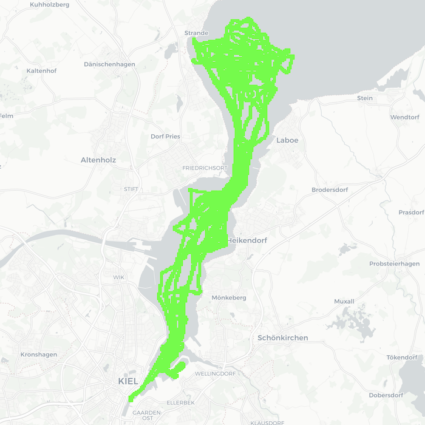

# FjordLink

Welcome to the FjordLink GitHub repository! 

The FjordLink is a combined Starlink and 5G dataset for coastal maritime connectivity. We collect over 500,000 measurements using a Flat High Performance dish and 5G modems on the research vessel, MS Wavelab in the Kiel Fjord (see the figure below for the measurement region, also check out detailed HTML maps) for four months. Starlink and 5G networks achieve median RTTs of less than 50 ms and mean upload throughputs exceeding 35 Mbps. Our results show that Starlink operates similarly (e.g., with a 10 ms median latency difference) in both maritime and terrestrial environments, and improves the 99th percentile latency compared to 5G networks. As a case study, we utilize traces from FjordLink in emulation to evaluate BBR, CUBIC, and Reno congestion control algorithms, where BBR achieves 18% higher upload throughput than CUBIC and Reno.

The paper is accepted at TBD.

For now, we include Starlink FHP dish terminal statistics and 5G router metrics. TWAMP (latency and jitter) and iPerf3 (throughput and jitter) measurements will be added soon.

This project is licensed under the terms of the Creative Commons Attribution 4.0 International License.



# Weather Data Disclaimer
For the use of weather data, please refer to the German Weather Service: [Deutscher Wetterdienst](https://www.dwd.de/DE/leistungen/opendata/opendata.html) 

# Usage:

1. Clone this Git repository to your local machine using the following command:

```
git clone https://github.com/ds-kiel/FjordLink.git
```

2. Create a virtual Python environment (e.g. using pyenv)

```
curl https://pyenv.run | bash
pyenv install 3.13
pyenv virtualenv 3.13 FjordLink
```

3. Install the necessary Python packages by running:

```
cd FjordLink
pip install -r requirements.txt -U
```

4. Download the dataset from TBD into the data folder


5. Analyze the data with the supplied Jupyter Notebooks


# Playback of traces in Emulation

1. Create a new interface for incoming traffic
```
ip link add dev ifb0 type ifb
ip link set dev ifb0 up
```

2. Redirect incoming traffic to the new interface
```
tc qdisc add dev eth0 ingress
tc filter add dev eth0 parent ffff: protocol ip u32 match u32 0 0 
    action mirred egress redirect dev ifb0
```

3. Setting up the prio qdisc on eth0
```
tc qdisc add dev  parent 1: handle 11: prio
```

4. Example for built tc rules on eth0
```
tc qdisc change dev eth0 root handle 1: netem \
    delay 11.2ms 1.5ms 
tc filter add dev eth0 parent 11: protocol ip pref 1 matchall \
    action police rate 19.72mbit burst 400k conform-exceed drop
```